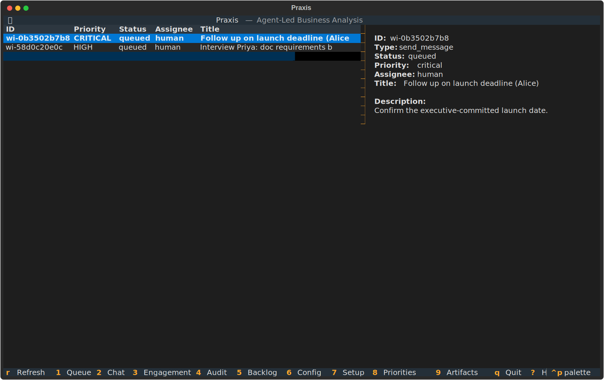
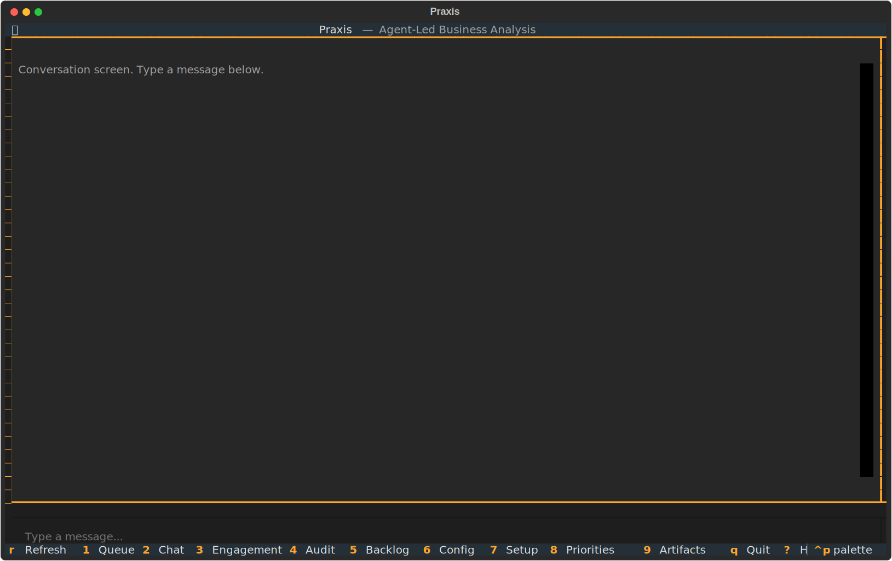
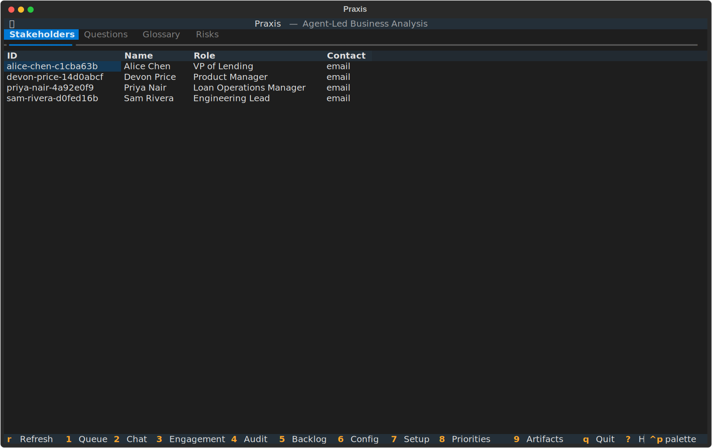
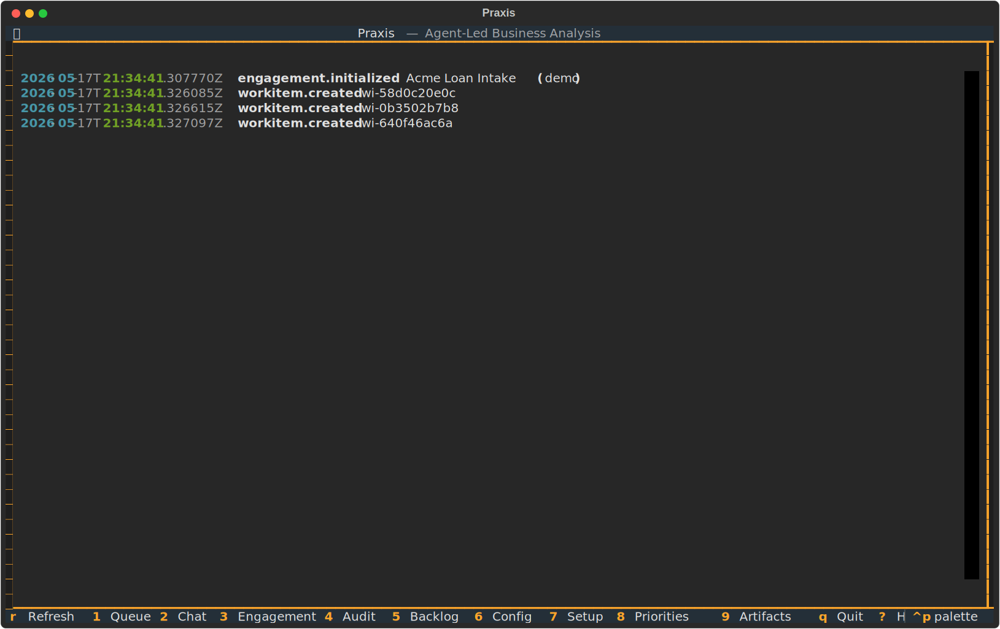
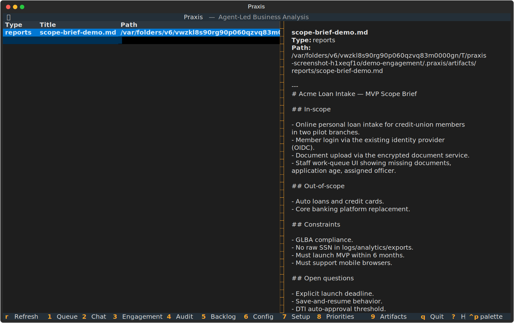
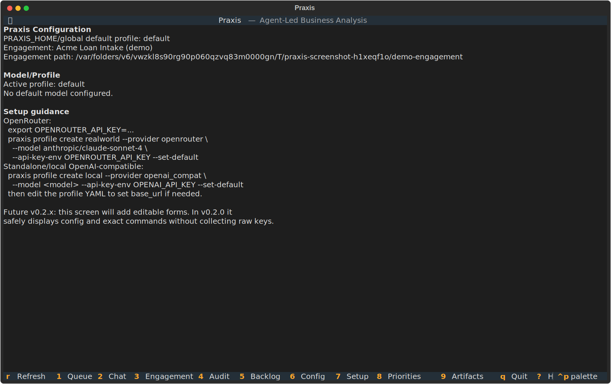
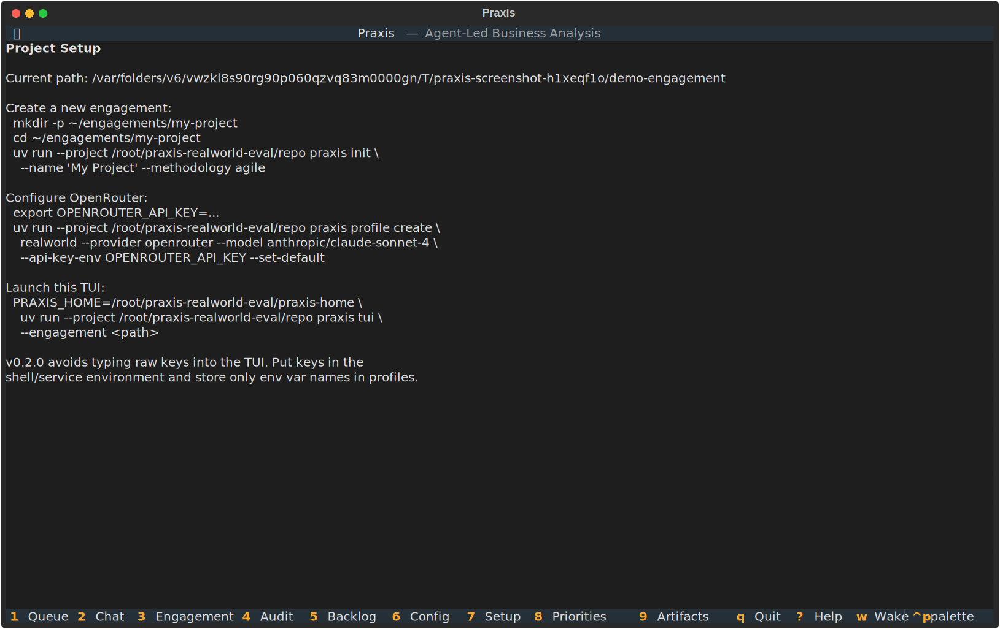
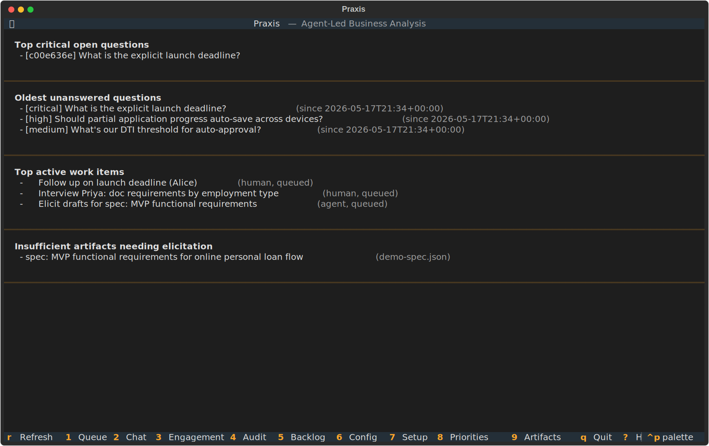
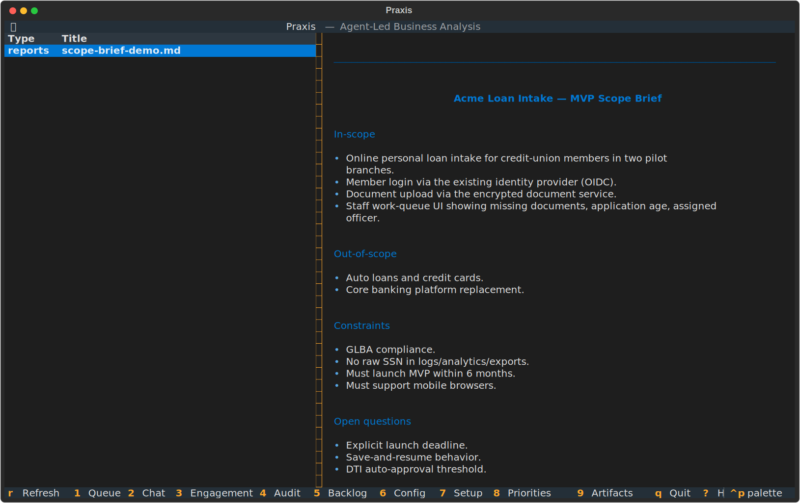

https://github.com/user-attachments/assets/68add11e-2df2-4cf4-96a0-aeee4ca490c1


> An open-source, **agent-led** framework for IT business analysis.

Praxis is a continuously-running analytical agent that performs the work of an
IT business / functional analyst. It drives the analytical process itself,
executes mechanical work directly, and hands off to a human operator only when
an action requires human commit (sending email, scheduling meetings, publishing
institutional artifacts).

Praxis is **not** a chatbot, copilot, or wrapper around an issue tracker. The
default surface is a work-queue and a typed engagement model — not a chat box.

---

## Why Praxis

| | |
|---|---|
| **Knowledge continuity** | Engagement state — decisions, constraints, glossary, open questions, stakeholders, risks — lives in typed YAML / Markdown files, not in an analyst's head. When a BA leaves, the replacement opens the queue and is productive in a day. |
| **Auditable by design** | Every decision, question, sufficiency verdict, wake cycle, and work-item transition is recorded with timestamp, actor, and subject. Useful for SOX / GLBA / HIPAA shops or any audit-conscious organisation. |
| **Local-first, no vendor lock-in** | All state on disk in human-readable formats — `cat`, `grep`, and `git diff` work. Engagements work fully offline. You own your engagement model; you can fork, backup, or migrate without permission. |
| **Provider-agnostic** | First-class adapters for Anthropic, OpenAI, OpenRouter, and any OpenAI-compatible local server (Ollama, vLLM, LM Studio). Switch models without changing engagements. |
| **Less expensive analyst time** | The agent drafts clarifying questions, scopes artifacts, and builds traceability matrices. The human focuses on judgment calls, stakeholder relationships, and decisions. |
| **Catches missing requirements early** | The Sufficiency Gate is an explicit, typed check before any artifact is produced — it identifies the gaps with named candidate sources, instead of letting you commit to building the wrong thing. |
| **Proactive, not reactive** | A scheduled wake cycle works the engagement while you sleep — surfaces stalled questions, detects new state changes, and flags insufficient artifacts. You open the queue and the agenda is already set. |
| **Engagement state as a git-friendly artifact** | Decisions are ADRs. Glossary is YAML. Backlog is Markdown. The whole engagement diffs cleanly; PR review actually works on analysis output. |

---

## Status

**Latest release: [v1.0.0](https://github.com/ermalha/Praxis-Engine/releases/tag/v1.0.0)** — production-ready architecture. See [STABILITY.md](STABILITY.md) for SemVer + deprecation policy.

Active development. The build plan is in `PROJECT.md` (architecture & principles)
and the per-feature briefs are in `chunks/`. Track progress in
`chunks/STATUS.md`.

---

## Install

| Requirement | Version | Notes |
|---|---|---|
| Python | 3.11+ | required |
| [uv](https://docs.astral.sh/uv/) | latest | package manager |
| LLM API key | — | Anthropic, OpenAI, or OpenRouter (skip for local/offline) |

**Recommended — single command, pinned to a tagged release:**

```bash
uv tool install --python 3.12 \
  "praxis-ba[all] @ git+https://github.com/ermalha/Praxis-Engine.git@v1.0.0"
praxis version    # → praxis 1.0.0
```

This drops `praxis` onto your `PATH` in an isolated environment. Replace
`@v1.0.0` with whatever release tag you want; `git+...@main` works too for
the development tip.

**Development install (clone + uv sync):**

```bash
git clone https://github.com/ermalha/Praxis-Engine.git
cd Praxis-Engine
uv sync --extra dev --extra all
```

A real `pip install praxis-ba` from PyPI is planned for a future release;
the `uv tool install` form above is the supported one-command path until
then.

---

## Quick start

Praxis runs the analytical loop a business / functional analyst runs manually — but as software, on persistent state, with an audit trail.

  

Three commands to get a first working engagement:

```bash
# 1. Create a profile (binds a name → provider + model + API-key env var)
export OPENAI_API_KEY=sk-...
uv run praxis profile create alice \
  --provider openai --model gpt-4.1 --api-key-env OPENAI_API_KEY

# 2. Initialize a new engagement in the current directory
mkdir my-project && cd my-project
uv run praxis init --name "Acme Loan Intake" --methodology agile

# 3. Ask the engagement-aware agent. The -e . flag primes it with your
#    engagement state and instructs the model to flag uncertainty rather
#    than invent. Try a real question:
uv run praxis ask -e . "Should we save partial application progress automatically?"
```

From here the full pipeline is: seed engagement state → `check` (sufficiency gate) → `elicit` (gap-driven stakeholder drafts) → `artifact generate` (produces state-grounded outputs, auto-bound to the sufficiency report) → `wake` (scheduled proactive cycle) → `tui` (your daily-driver workspace).

→ **Full setup-to-output walkthrough with real captured output blocks at every step:** [`docs/how-to/first-engagement.md`](docs/how-to/first-engagement.md). Cold-runs end-to-end on a fresh checkout; the non-LLM steps are exercised by CI on every push.

---

## The TUI

The TUI is the analyst's day-to-day surface. All screens auto-refresh on a
3-second interval, so agent-driven state changes appear live without manual
reload. Press the screen number (1–9), `r` to manually refresh, `w` to
trigger a wake cycle, `q` to quit.

### Queue (key `1`) — prioritized work-items



### Chat (key `2`) — agent REPL with engagement context



### Engagement (key `3`) — browse stakeholders, glossary, decisions



### Audit (key `4`) — every state change, timestamped



### Backlog (key `5`) — generated artifacts list



### Config (key `6`) — profile + engagement config



### Setup (key `7`) — guided project initialization



### Priorities (key `8`) — what to work on now

The "what should I work on?" view: top critical open questions, oldest
unanswered, top active work items, insufficient artifacts needing
elicitation.



### Artifact Viewer (key `9`) — rendered markdown of any generated artifact



> Screenshots are SVG, regenerated from a seeded demo engagement.
> Run `uv run python scripts/gen_screenshots.py` to refresh them.

---

## Architecture

```
                  ┌─────────────────────────────────────────┐
                  │        ENGAGEMENT MODEL (memory)         │
                  │  who, what, decisions, history, history  │
                  └────────────────┬────────────────────────┘
                                   │
                        ┌──────────┴──────────┐
                        │   ORCHESTRATOR      │
                        │  (the BA agent)     │
                        └──────────┬──────────┘
                                   │
                     ┌─────────────┴──────────────┐
                     │                            │
            ┌────────▼─────────┐         ┌────────▼─────────┐
            │  SUFFICIENCY     │   YES   │   ARTIFACT       │
            │     GATE         ├────────►│   PRODUCER       │
            └────────┬─────────┘         └──────────────────┘
                     │ NO
            ┌────────▼─────────┐
            │   ELICITATION    │
            │     PLANNER      │
            └────────┬─────────┘
                     │
                     ▼
            ┌──────────────────┐         ┌──────────────────┐
            │  HUMAN WORK-ITEM │◄───────►│  HUMAN OPERATOR  │
            │      QUEUE       │  reply  │   (analyst)      │
            └──────────────────┘         └──────────────────┘
```

Full architecture in `PROJECT.md`; diagrams in `docs/architecture.md`.

---

## Three things that make Praxis different from a chat agent

1. **Proactive wake cycle** — scheduled, not reactive turn-taking. The agent runs *because the clock said so*, not because you asked.
2. **Sufficiency Gate** — typed self-check before any artifact production. Praxis says "I don't have enough" loudly, with citations.
3. **Structured engagement model** — typed YAML/MD files (glossary, stakeholders, decisions, open questions, system landscape, risks, assumptions/constraints, timeline) instead of flat memory.

If a design choice you're considering would erase any of those three, stop and ask.

---

## Documentation

- **`PROJECT.md`** — architecture, principles, tech stack
- **`CHANGELOG.md`** — what shipped in each release
- **`CONTRIBUTING.md`** — how to contribute
- **`chunks/`** — feature briefs (numbered, dependency-ordered)
- **`docs/concepts/`** — engagement model, sufficiency gate, work-queue, agent-led vs reactive
- **`docs/how-to/`** — first chat, connect Jira, author a skill, etc.
- **`docs/reference/`** — API, schemas, keybinds, config

---

## License

MIT. See `LICENSE`.

---

## Acknowledgments

- [Nous Research](https://nousresearch.com/) — Hermes Agent foundational patterns
- [browser-use](https://github.com/browser-use) — Browser Harness bitter-lesson approach
- The [BABOK](https://www.iiba.org/career-resources/a-business-analysis-professional-s-foundation-for-success/) — names for the BA techniques the bundled skills derive from
