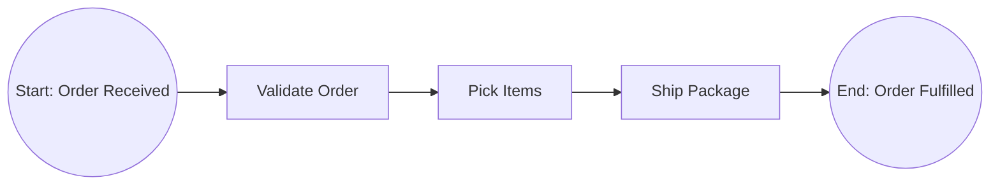
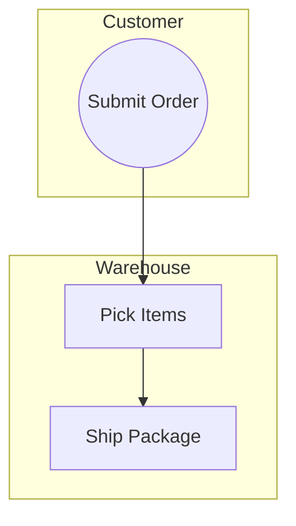

# Process Modeling — BPMN in Text/Mermaid

## Purpose

A BPMN process model turns a narrative description of how work flows into an
unambiguous visual. It exposes handoff delays, redundant approvals, and
decision points that are invisible in paragraphs of text. For a BA, this is
one of the most powerful communication tools you have: a correct process map
ends arguments about "who does what" faster than any meeting.

This skill focuses on producing BPMN-conformant diagrams using Mermaid syntax
(or equivalent text-based notation) so that models live inside version-
controlled Markdown files and render without proprietary tools.

## Procedure

### 1. Identify the process boundaries

Before drawing anything, answer:
- **Trigger:** What event starts this process? (e.g., "Customer submits order")
- **End state:** What marks completion? (e.g., "Order shipped and invoice sent")
- **Scope exclusions:** What upstream/downstream processes are explicitly out?

Document these boundaries at the top of your model file.

### 2. List participants (pools/swimlanes)

Each distinct actor or system that performs work gets a lane:
- Use role names, not person names ("Approver," not "Sarah")
- Separate human lanes from system lanes
- If two roles always act together, collapse into one lane until you have
  evidence they diverge

### 3. Draft the happy path first

Map the straight-through sequence from trigger to end with no branches:
1. Start event (circle)
2. Sequence of tasks (rounded rectangles)
3. End event (bold circle)

In Mermaid flowchart syntax, this looks like:

### 4. Add gateways (decision/parallel/inclusive)

- **Exclusive gateway (XOR):** Exactly one outgoing path is taken. Use a
  diamond with an "X" or label the condition on each branch.
- **Parallel gateway (AND):** All paths execute concurrently. Use a diamond
  with a "+" marker.
- **Inclusive gateway (OR):** One or more paths taken. Use a diamond with an
  "O" marker.

Every gateway that splits MUST have a corresponding merge gateway downstream
unless a path leads directly to an end event.

### 5. Add swimlane assignments

In Mermaid, use subgraphs to represent lanes:

### 6. Add message flows and intermediate events

- **Message flows** cross pool boundaries (dashed arrows). They represent
  communication, not control flow.
- **Intermediate events** (timer, message catch, error) go on the sequence
  flow where a wait or exception occurs.

### 7. Annotate with metadata

Below the diagram, add a table listing each task with:
- Task ID, Task Name, Performer, Estimated Duration, System/Tool Used

## Pitfalls

1. **Spaghetti diagrams** — If your model has more than 15 tasks or crosses
   more than three gateways, decompose it into sub-processes. A model nobody
   reads is a model nobody uses.

2. **Missing merge gateways** — Every split must have a corresponding join.
   An unmatched parallel split means the process has undefined behavior after
   the branches complete.

3. **Confusing message flows with sequence flows** — Sequence flows connect
   tasks within a single participant. Message flows connect tasks across
   participants. Mixing them up misrepresents who controls the flow.

4. **Using task labels as implementation instructions** — A task should say
   WHAT is done ("Validate credit score"), not HOW ("Call Experian API v2.3
   endpoint /score with JSON payload"). Keep the model at the business level.

5. **No start or end events** — Every pool must have at least one start event
   and one end event. A model without them is ambiguous about when work begins
   and when it is considered complete.

## Verification

- [ ] Process has exactly one start event per pool and at least one end event
- [ ] Every exclusive gateway branch is labeled with a condition
- [ ] Every split gateway has a corresponding merge (or explicit termination)
- [ ] Swimlanes match roles, not individuals
- [ ] No task exceeds 5-7 words (brief, verb-noun format)
- [ ] Message flows only cross pool boundaries
- [ ] The diagram renders correctly in Mermaid-compatible viewers
- [ ] A task metadata table accompanies the diagram

## BABOK Reference

Aligns with BABOK v3 Technique 10.38 (Process Modelling) and supports Task
6.1 (Define Future State) and Task 5.4 (Define Design Options). The emphasis
on swimlanes and message flows connects to Technique 10.41 (Scope Modelling)
for clarifying organizational boundaries.
