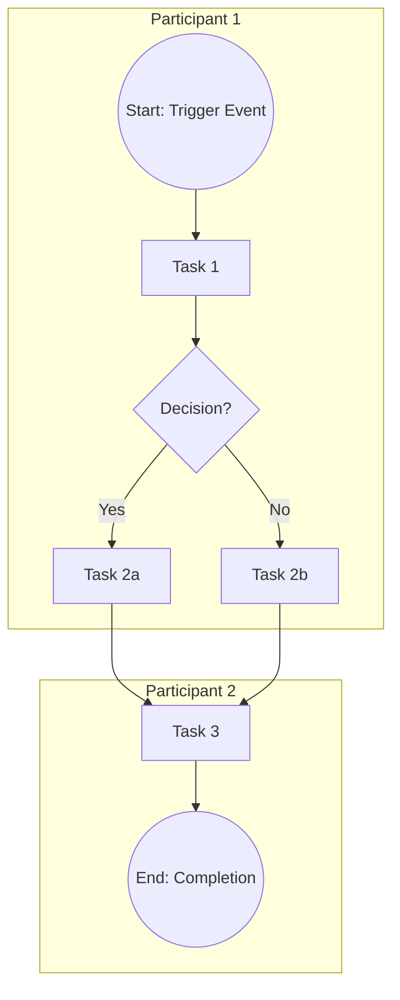

# Process Model: [Process Name]

## Process Boundaries

| Attribute | Value |
|-----------|-------|
| **Trigger** | [What event starts this process?] |
| **End State** | [What marks successful completion?] |
| **Scope Exclusions** | [What is explicitly out of scope?] |
| **Process Owner** | [Role responsible for process performance] |

## Participants

| Lane | Type | Description |
|------|------|-------------|
| [Role/System Name] | Human / System | [Brief responsibility] |
| [Role/System Name] | Human / System | [Brief responsibility] |

## Process Diagram

## Task Detail

| ID | Task Name | Performer | Est. Duration | System/Tool | Notes |
|----|-----------|-----------|:---:|-------------|-------|
| T1 | [Task 1] | [Role] | [time] | [tool] | |
| T2 | [Task 2a] | [Role] | [time] | [tool] | |
| T3 | [Task 2b] | [Role] | [time] | [tool] | |
| T4 | [Task 3] | [Role] | [time] | [tool] | |

## Gateway Logic

| Gateway ID | Type | Condition(s) |
|-----------|------|--------------|
| G1 | Exclusive (XOR) | Yes: [condition] / No: [condition] |

## Exceptions & Alternate Flows

| Exception | Trigger | Handling |
|-----------|---------|----------|
| [Error/timeout] | [What causes it] | [How the process responds] |

## Version History

| Version | Date | Author | Change |
|---------|------|--------|--------|
| 0.1 | [date] | [name] | Initial draft |
